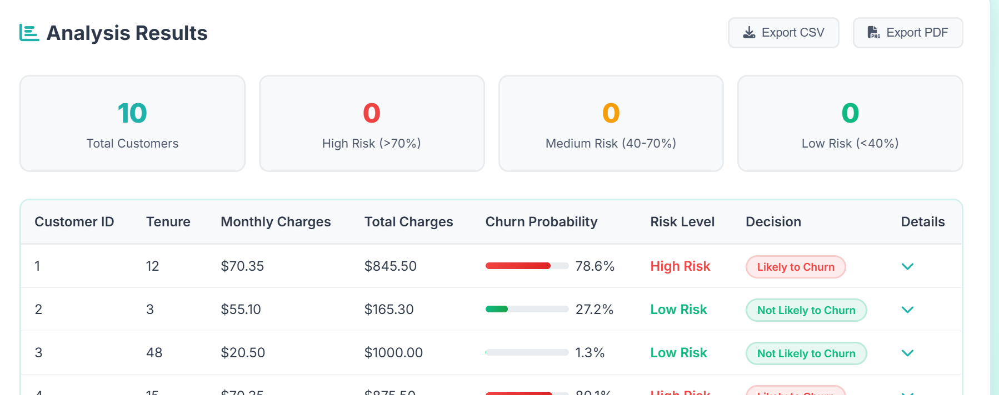
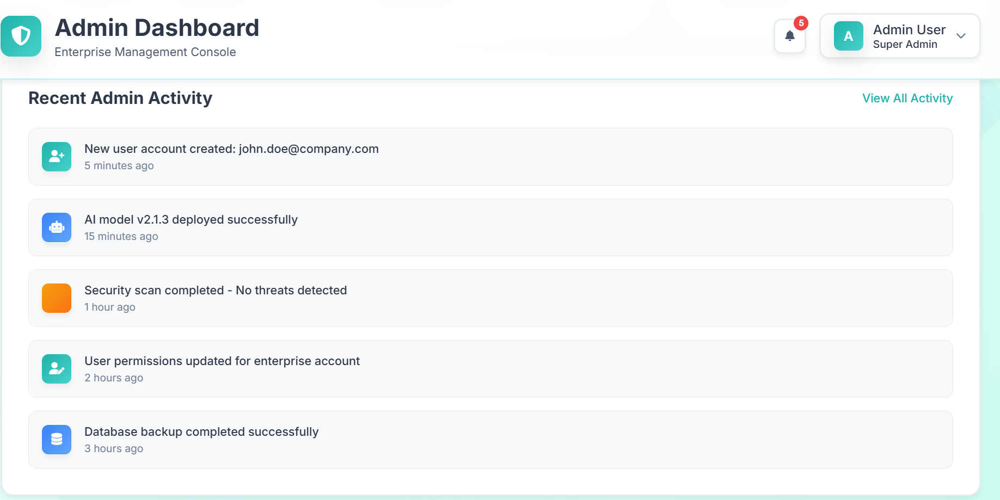

# Retention AI - Customer Churn Prediction System (Django + Ensemble AI)

**Retention AI** is an AI-powered web platform that helps businesses predict customer churn with high accuracy. Using an ensemble of advanced machine learning models — **CatBoost**, **LightGBM**, and **XGBoost** — it identifies customers who are likely to leave and provides intelligent recommendations to retain them.

🧠 Built with **Django**, RetentionAI allows:
- 📋 Single customer predictions through a smart form.
- 📁 Bulk churn analysis via CSV uploads.
- 🔍 AI-driven insights and retention suggestions based on customer behavior.

Ideal for telecoms, subscription platforms, and service-based businesses seeking to reduce customer loss and improve decision-making.

---

## ✨ Features

* ✅ **User Authentication** (Signup/Login)
* ✅ **Single Customer Prediction** (via smart form)
* ✅ **Batch Prediction** (upload CSV file)
* ✅ **AI Reasoning & Suggestions** (based on churn factors)
* ✅ **Admin Dashboard** and User Profile Views
* ✅ Clean, modern UI with loading animations & validation

---

## 🎓 Tech Stack

| Layer         | Tech                        |
| ------------- | --------------------------- |
| Backend       | Django                      |
| ML Models     | CatBoost, LightGBM, XGBoost |
| Frontend      | HTML, CSS, Bootstrap Icons  |
| Visualization | None (lightweight UI)       |
| Auth          | Django Auth                 |

---

## ⚡ Setup Instructions

### 1. Clone the Project

```bash
git clone https://github.com/yourname/churn-prediction-django.git
cd churn-prediction-django
```

### 2. Create & Activate Virtual Environment

```bash
python -m venv env
source env/bin/activate      # On Windows: env\Scripts\activate
```

### 3. Install Requirements

```bash
pip install -r requirements.txt
```

### 4. Prepare the Models (Already Trained)

Place the following 6 files in:

```
churn/models/
├── catboost_model.cbm
├── lgb_model.pkl
├── xgb_model.pkl
├── best_threshold.txt
├── cat_columns.json
└── onehot_columns.json
```

### 5. Run Migrations & Server

```bash
python manage.py migrate
python manage.py runserver
```

---

## ⚙ How It Works

* Form input is parsed and encoded in two formats:

  * Raw (for CatBoost)
  * One-hot (for LightGBM/XGBoost)

* All 3 models return probabilities, which are **averaged**.

* If probability > threshold (optimized during training), system flags churn.

* Reasons/suggestions are generated based on business logic.

---

## 📚 Sample Use Case

> A telecom company wants to predict customer churn:

* A support agent logs in.
* Enters customer details via form.
* Gets churn probability + AI suggestions (e.g. reduce pricing).
* Or uploads CSV for 1000 customers in bulk.

---

## 📚 Sample CSV Format

```csv
tenure,MonthlyCharges,TotalCharges,gender,SeniorCitizen,Partner,Dependents,PhoneService,...
24,75.5,1600.2,Female,0,Yes,No,Yes,...
```

(Include all model-required columns)

---

## 🖼️ Screenshots

### 🏠 Home & Landing Page

| Home Page | Actions | Landing |
|----------|---------|---------|
|  |  |  |
|  |  |  |
|  |  |  |

---

### 🔐 Authentication Pages

| Sign In | Sign Up |
|--------|---------|
|  |  |

---

### 🧠 Prediction (Single)

| Question Sample 1 | Question Sample 2 | Result |
|------------------|------------------|--------|
|  |  |  |
|  |  |  |
|  |  |  |

---

### 📊 Batch Prediction

| Upload CSV | CSV Uploaded | Batch Result |
|------------|--------------|--------------|
|  |  |  |

---

### 🛠️ Admin Dashboard

| Dashboard View 1 | Dashboard View 2 | Dashboard View 3 |
|------------------|------------------|------------------|
|  |  |  |

---

### 💼 Services

| Services | Services (Alt) |
|----------|----------------|
|  |  |

---

## 🌟 Credits

* ML Modeling by: SyedSaadAli
* Django Development by: SyedSaadAli
* UI/UX: Bootstrap 5, FontAwesome

---

## ✉ Contact

For queries, suggestions, or improvements, feel free to reach out:

📧 [syedsaadi427@gmail.com](mailto:syedsaadi427@gmail.com)

